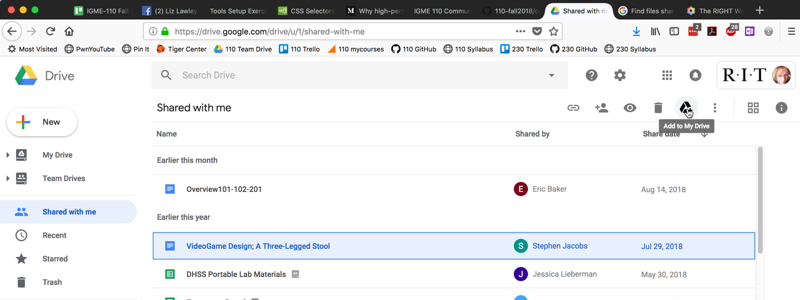
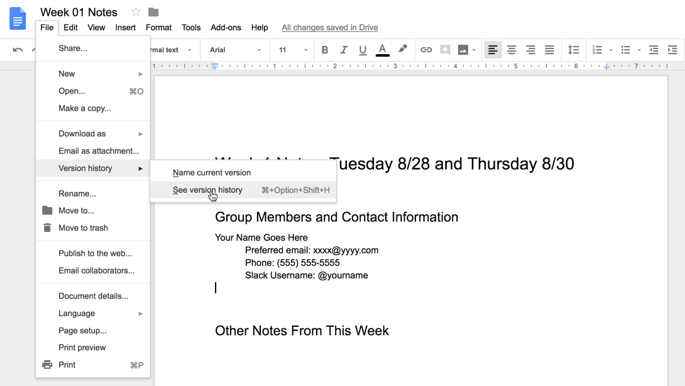
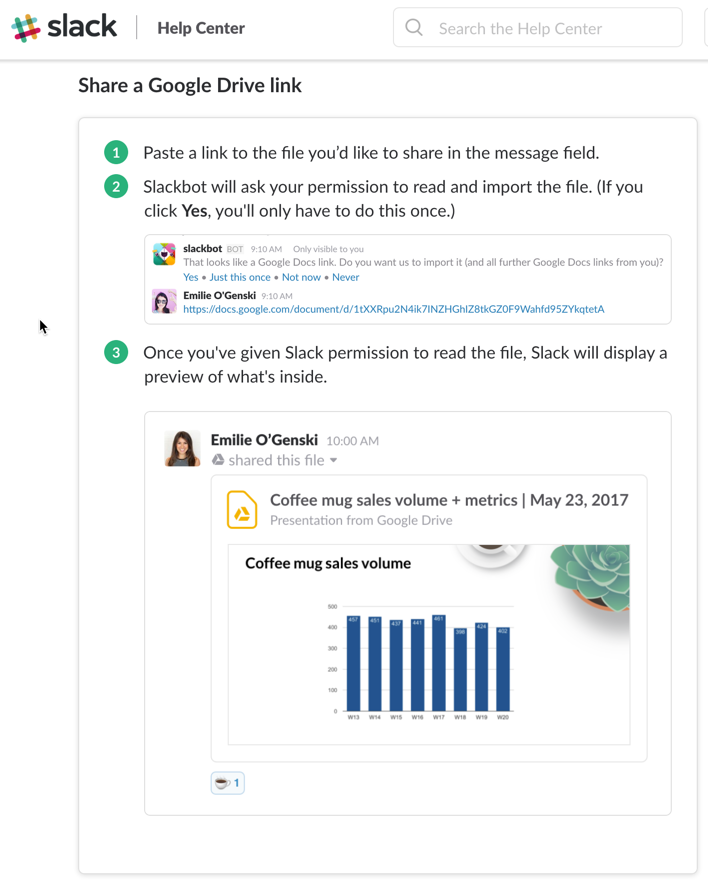

|  Introduction to Interactive Media (IGME-110), Fall 2019 | [Syllabus](https://lawleyfall2019.github.io/110-fall2019/) | [Schedule](https://lawleyfall2019.github.io/110-fall2019/schedule.html) |
|----|----|----|

# Collaboration Tools Exercise (Week 1, Thursday, 8/29)

In today's exercise, you'll learn how to use collaborative editing in Google Drive for in-class note-taking, and how to use private channels in Slack for group discussions.

## Part 1: Google Drive Group Folder

Log into RIT's Google Apps site (http://google.rit.edu), go to the Drive section, and select the "Shared With Me" option in the left sidebar. You should see a folder for your group (e.g. "110-0x Group x"). If you don't see it, let Professor Lawley or Emily know that there's a problem.

1. Select the group folder, and then select the "Add to My Drive" icon at the top of the screen:

2. Select "My Drive" from the left sidebar; you should now see the folder listed there.
    
3. Open the group folder, and then open the "Week 01 Notes" document inside it. Add your name and contact information to this document, so your group knows how to get in touch with you.
    
4. Look at the version history for the file by choosing File-->Version History-->See Version History. This is what the TA and I will use to see if you've been contributing to the notes on a regular basis.

## Part 2: Private Slack Channels

Using either a web browser or the Slack client (on the lab PC or on your own device), log into the class Slack.

1. Find your group's private channel; it should show up in the channel list on the left side, or you can look through the list of all channels in the team by clicking on the "Channels" heading in the sidebar. If you don't see a private channel with your group's number, it's because we couldn't find you on Slack when we set them up this morning; ask Professor Lawley or Emily to add you now.

2. Copy the URL for your Week 1 Notes document into your group's channel from your Google Drive notes folder to your group's private channel. (Yes, this means that a lot of people will share the same document. That's okay, this is just practice.)

3. Configure your Slack notifications. You can change the overall settings for the Slack, and then you can override the global settings on a channel-by-channel basis. What I generally do is turn on all notifications for the class, and then mute individual channels, like #music, that I don't need immediate updates from. You're welcome to set it up in whatever way works best for you. (However, since the #announcements channel is used only by the professor and TA for class-wide announcements, it's a bad idea to mute or leave that channel!)

## Deliverables

**Before you leave class on Thursday**, you should have:

* Added your group's folder to your own Google Drive
* Edited your group's week 1 notes file
* Shared the URL for your group's week 1 notes file to your group's private channel in Slack