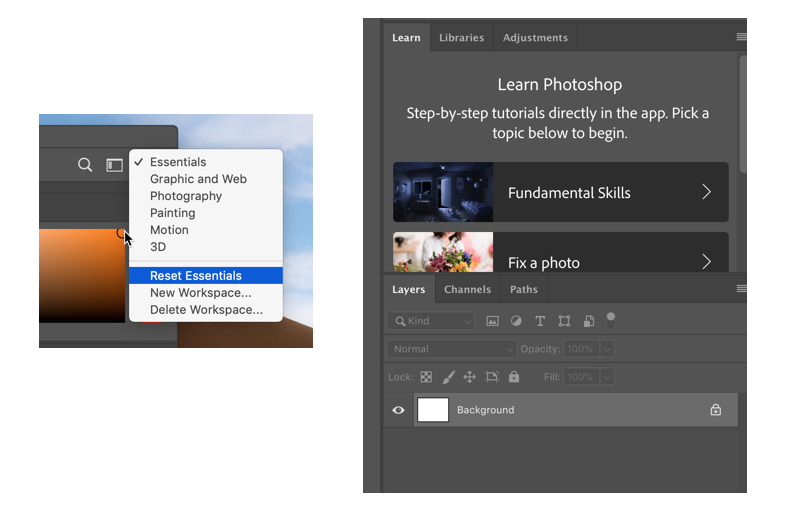

|  Introduction to Interactive Media (IGME-110), Fall 2019 | [Syllabus](https://lawleyfall2019.github.io/110-fall2019/) | [Schedule](https://lawleyfall2019.github.io/110-fall2019/schedule.html) |
|----|----|----|

# Layers and Compositing Exercise (Week 5, Thursday)

This exercise will give you a chance to have some fun while increasing your personal skills and understanding of layers in Photoshop.

## The Magazine Cover

Using a photograph of yourself or of an RIT faculty or staff member, make that person the subject of a magazine cover.  For example, make the subject look like Time Magazine's "Person of the Year," or find an interesting issue of People or Rolling Stone and make the cover story about your subject. If you just substitute the face of the person you chose for the original face on the cover, and do it clumsily so that the substitution is crude and obvious (you can see mismatched borders, for example), that is not a good solution to the problem.  If the substitution is done in a way that skillfully blends into the existing cover, that will be better. (Good rule of thumb: Do not create anything that you would be embarrassed to have the person in question actually see.)

Better still, make a completely fictional facsimile of an existing magazine cover, copying the fonts, colors and style; in other words, it looks authentic but never actually existed.

Whatever magazine you pick, your magazine cover should look convincingly like the actual magazine.

## Resources
### Photoshop
- The most recent version of Photoshop CC has a built-in "Essentials" tutorial that will walk you through fundamental concepts and compositing tools. To get to it, click on the dropdown menu in the top right corner of the photoshop editing window, and select "Reset Essentials". You'll then see a "Learn" tab that provides interactive tutorials. 
 
- RIT has a subscription to [LinkedIn Learning](https://www.linkedin.com/checkpoint/enterprise/login/42272537?application=learning) (formerly Lynda.com). There are a number of excellent Photoshop tutorials on that site:
    - [Photoshop CC 2019: The Basics](https://www.linkedin.com/learning/photoshop-cc-2019-essential-training-the-basics/welcome-to-the-essentials-of-photoshop?u=42272537) (especially sections 5-9)
    - [Photoshop Compositing: Tips,Tricks, & Techniques](https://www.linkedin.com/learning/photoshop-compositing-tips-tricks-techniques/welcome-2?u=42272537)

### Photoshop Alternatives
- [GIMP](https://www.gimp.org/) is a free, cross-platform, open source image editing program with functionality that is comparable to Photoshop. 
- [Canva](http://canva.com) and [Adobe Spark](https://www.gimp.org/) are web-based image editing programs that provides good layout tools. Both have basic versions that are free. 

## Deliverables
You need to provide two files--the finished magazine cover image, and a brief (2-3 paragraph) description of the sources, tools, and methods you used to create it. 

The files should be uploaded to the `Compositing Exercise` dropbox in myCourses by **8am on Tuesday, 10/1**. 
