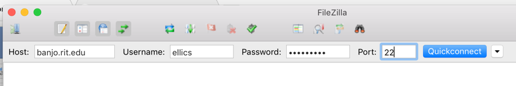
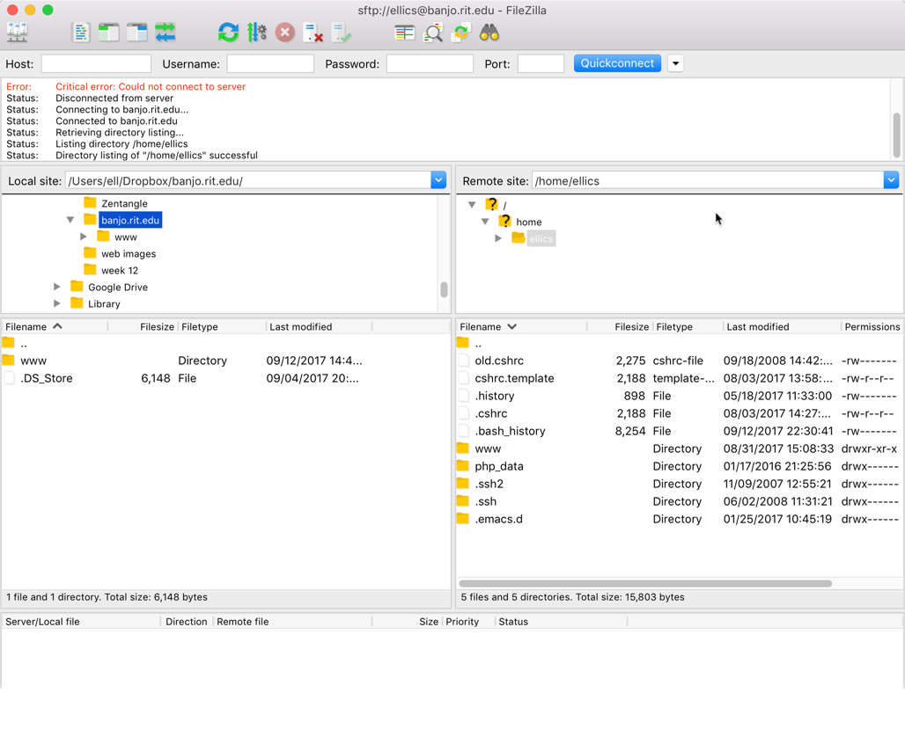
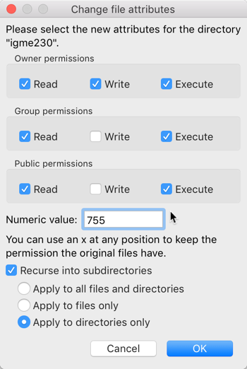
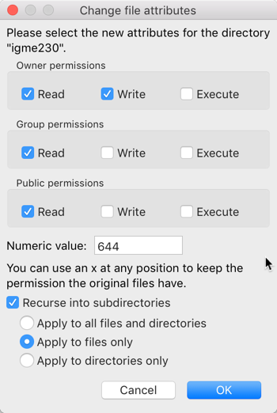

|Introduction to Interactive Media (IGME-110), Fall 2019 | [Syllabus](https://lawleyfall2019.github.io/110-fall2019/) | [Schedule](https://lawleyfall2019.github.io/110-fall2019/schedule.html#week10) |
|----|----|----|

# FTP Optional Exercise (Week 10) 

While GitHub is an excellent choice for publishing a basic website, in later classes you may be asked to publish your web pages to RIT's people.rit.edu server. This is a quick tutorial on how to do that. 

## Part 1: Introduction

To publish pages to people.rit.edu, you're going to use FTP (actually SFTP, which uses a secure connection to the server) to upload the files onto a server called banjo.rit.edu.

You can use whichever SFTP (secure File Transfer Program) you’d like to uplaod files to the server. In the IGM labs, we have FileZilla installed, so that’s what’s used in this documentation. (You can download FileZilla for your own computer; if you’re using Windows, I strongly suggest downloading the .zip file rather than the .exe file, since the executable file will try to install browser addons that can cause all kinds of problems.)

Launch FileZilla. Fill in the fields at the top with the following information, and click “Quickconnect”:
 

FileZilla may ask you if you want it to remember passwords—if you’re doing this in the lab, tell it no. If this is the first time you’ve used FileZilla on a lab computer, it may also give you a warning about an “unknown host key”—if that happens, check the box saying “Always trust this host” and then click OK. If you entered your user ID and password correctly, you should now see something like this:

 

The pane on the bottom left shows the files on your computer’s hard drive. In this case, it’s showing everything, including hidden files, that are on the main level of my computer’s hard drive. The pane on the right shows all the files, including hidden files, in your home directory on RIT’s web server.

In the pane on the left side (local site files), you’ll need to find the directory that you created at the beginning of this exercise. If you put it on a thumb drive, the drive should show up in the Volumes directory. If you put it on the Desktop, it should be in the student directory inside of the Users directory. You want to find your www folder and open it, so that you can see the igme110 and media folders in the left pane. (If you’re using Mac, there may also be a hidden file called .DS_Store, which you can ignore—it’s a Mac system file that is hidden.) If you have trouble finding your files, ask for help.

In the pane on the right side (server files), double click on the www directory. You should see the 110 directory that you created in Tuesday’s exercise. Leave that alone until you’ve gotten credit for the exercise!

Once you’ve got the www directory on your local computer on the left side, and your www directory on banjo on the right side, you’re going to drag the igme110 directory from the www folder on the left (your computer) to the www folder on the right (the server). This will copy the folder and its contents to the web server. The file list on the right side should update to show the the new directories.

Now you need to test the files on the web server, to see if they’re accessible. Use a browser to go to `http://people.rit.edu/youruserid/igme110` (substituting your RIT ID for youruserid)

If the files and images show up, great! But it’s possible that they won’t, because the access to the files may not be set properly by default.

Part 2: File Permissions

In FileZilla, select the www folder in the right pane (on the server) Right click on the folder in the right pane, choose “File Permissions” and make sure the permissions include read write and execute for the owner (that’s you), and read and execute for everyone else. The number in the box at the bottom should read “755” which is shorthand for those permissions. (You can either type the number into the box at the bottom, or check the boxes next to the permissions you want.) Make sure the box that reads “recurse into subdirectories” is selected, and choose “Apply to directories only.” Click OK. This should change the permissions for the www directory, and all directories below of it, including the igme110 directory and the test directory.

 

Once you’ve changed the permissions on the folders, you need to repeat that process for the files. (Select the "Apply to Files Only" option at the bottom of the window.) They don’t need execute permissions, so the shortcut for their permissions is 644 rather than 755.

 

Once you’ve changed the folder and file permissions for the www directory and everything inside of it, go back to the browser and try loading `http://people.rit.edu/youruserid/igme110` again.

Notice that the URL I gave you only has the directory name (igme110) and not a file name. That is because the RIT server, like most web servers, automatically looks for a file called index.html in a folder if no other file was specified. If you were to include the file name in the URL (e.g. `http://people.rit.edu/youruserid/igme110/index.html`), it would also recognize that file and load it. But if you end the URL with the directory name and don’t specify a file, the server will automatically load the index.html file if there is one in that directory.

Once you've gotten your page to display properly, view the source in the web browser (if you’re using Chrome, type Ctrl-U to display the page source). You’ll probably see a big block of completely unfamiliar code near the top of your page, where your first image is embedded. In the next section, I’ll explain where that came from, and how we can make it go away.

