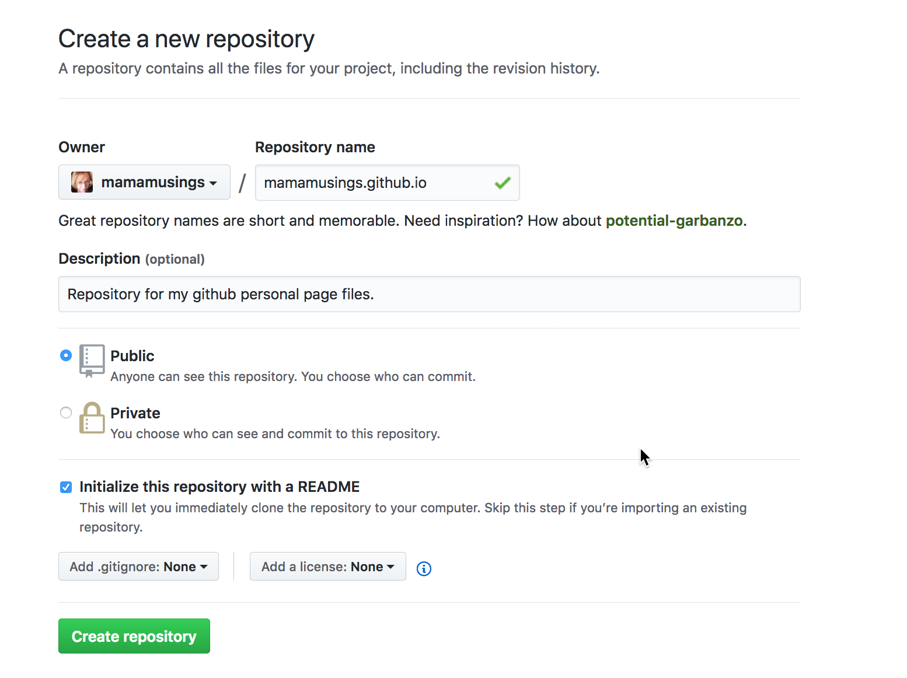
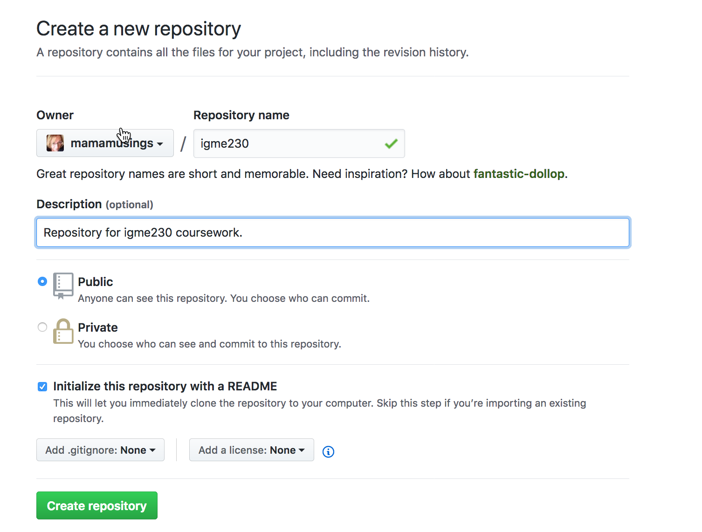

# GitHub Pages Exercise (Week 10, Thursday)

As discussed in lecture, GitHub provides the ability to publish a basic website from a repository. In this exercise, you’ll learn how to create a website associated with your GitHub username, as well as how to create one associated with a specific project/repository.

***Do NOT start this exercise until you have successfully completed the exercise from Tuesday***

## Part 1: Creating a Personal GitHub Pages Site
If you already have a personal GitHub Pages site, you can skip this.)

If you have a repository named *username*.github.io in your GitHub account, it will automatically be used to serve web pages from that address. You can see an example at https://github.com/mamamusings/mamamusings.github.io (the github directory) and http://mamamusings.github.io (the resulting website).

In your GitHub account, create a new (public) repository called *username*.github.io.

Add a brief description, make sure the repository is public, and click the box to create a README.md file.

 

You'll be taken to the web page for the new repository,which should look a lot like this:

In your browser, go to *username*.github.io; you should see the readme page come up. *If it doesn't work, ask for help before proceeding!!*

Now you need to clone the new repository to your computer (using the same process you used in Tuesday's exercise--copy the clone URL from the GitHub repository, and use the git clone option in your editor.
                
Once you've cloned the repo, and you have it open in your editor, create an index.html file that includes your name and an image. Use CSS to make it look moderately professional. Commit the new file, and sync your files to GitHub. Then use a web browser to go to *username*.github.io. -- your files should show up there!

***If you don't see your file there, ask for help before proceeding!***

(Note: Once this exercise has been graded, you can feel free to delete the files you created, or replace them with your own content.)

## Part 2: Creating a Project-Based GitHub Site
You’ll be publishing all of your work for this class using GitHub pages, and creating a "landing page" so that it's easy for the professor and TA to quickly access your exercises and projects. 

While you could just create a subdirectory in your personal site directory, a better approach is to create a separate repository for your work in this class, and using the personal directory you created above for your own non-class-related personal page(s). 

Create another new repository called igme110 in your account.(The example below uses igme230; you can just substitute 110 wherever you see 230.)

                
As you did in part 1, clone the repository to your computer, and use your editor to create a simple index.html file that includes your name and the class name (no need to format it, or even use CSS if you don't want to).

Sync the file to GitHub. Unlike your personal GitHub pages site, however, the page will not be immediately published on github.io. You'll need to explicitly set this repository up to publish with GitHub Pages.

On the GitHub site, go to your igme110 repository (github.com/*username*/igme110), select “Settings”, and scroll down to the GitHub Pages settings. Choose master branch as your source, and save. (Do *not* try to install a Theme; these do not use standard HTML, but instead use a templating language based on the Ruby programming language. If you want to explore using Jekyll Themes, you should create a separate repository for that.) After you save your new settings, you should see this:

Your index.html page should now be visible at *username*.github.io/igme110; try clinking on the link provided in the settings page to test it.

All of the work you do for this class moving forward will be published to this repository, rather than to an RIT server. That allows me to see your revision history, and to make suggestions for revisions using pull requests. 

## Deliverables
Submit your *username*.github.io/igme110 URL to the myCourses Assignment dropbox by tomorrow (Friday) at noon. 
