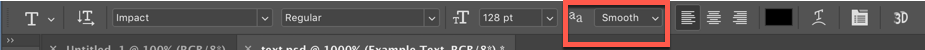
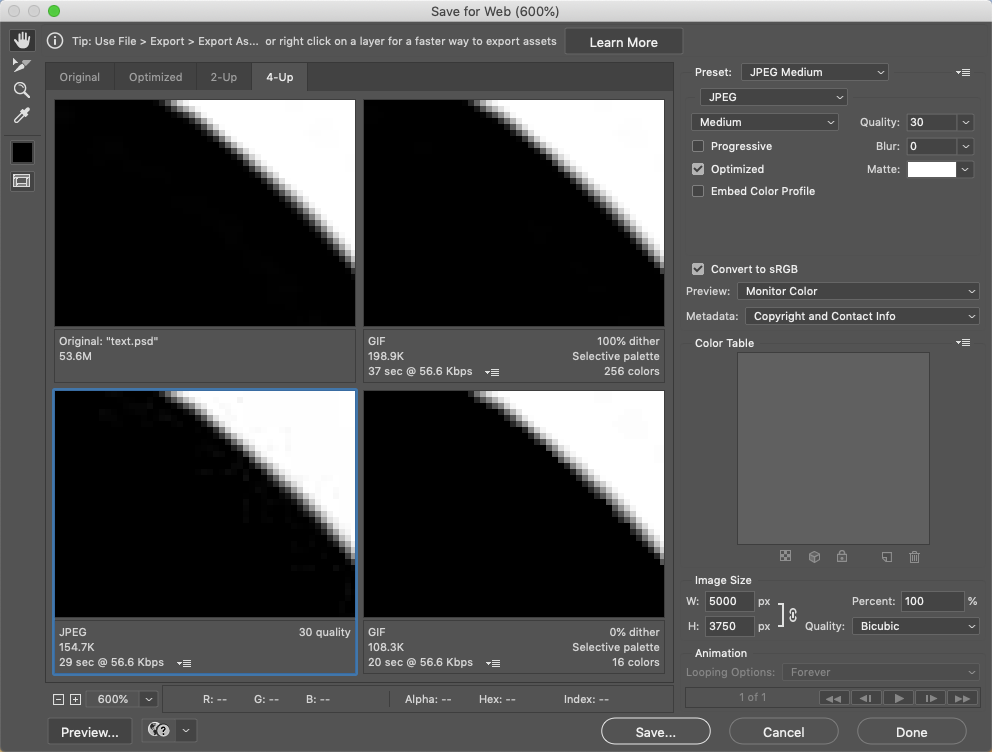
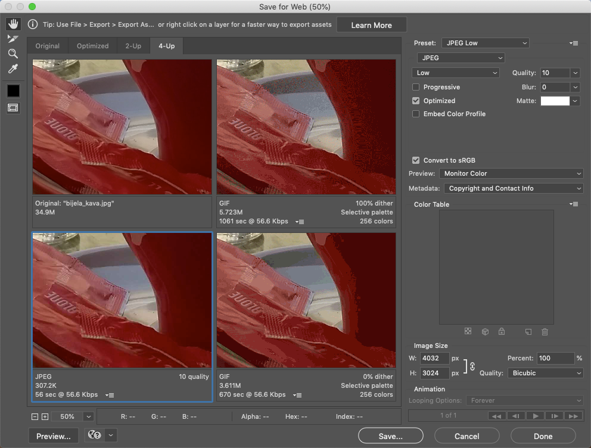

# Image Basics: Color, Compression, and File Optimization

## Part 1: Color Models

For today's exercise, you’ll be using Photoshop files that are contained in [exampleImages.zip](exampleImages.zip). (Right-click on the link and choose "Save Link As...".) 

1. Open the file Sunflower150.jpg in Photoshop.
2. Display the Channels Window (Window > Channels)
3. View the Image > Mode menu. The current color mode of the image (RGB, PhotoShop’s default) has a check mark next to it in the mode menu. What menu items are grayed out? (Make a note of this.)
4. Switch the mode to CMYK. (If you get a warning, click Yes to proceed.) Note the changes in the Channels window.
5. View the Mode menu again. How have the options changed?
6. Switch the mode to Grayscale (if prompted, agree to discarding color changes). What happens to the Channels window now? Look at the mode menu: what’s different?
7. You now have access to the Bitmap option in the Mode menu. This refers to the strictest definition of a bitmap, or a 1-bit color image, where each pixel in the image is mapped to one bit of information; on or off, white or black.
8. Change the mode to Bitmap. Set the output resolution to 96ppi and the diffusion method to Diffusion Dither. Try zooming in, so you can see the individual pixels.
9. After viewing the results, select History from the Window menu. You will see a list of your modifications to the image. Return to the original ("Open") version. The changes you made are all still listed, and you can go back to any of them.
10. In the bottom left corner of the window, next to the zoom percentage, you should see "Doc:2.41M/2.41M". The number on the left represents the printing size of the image--approximately the size of the saved, flattened file in Adobe Photoshop format. The number on the right indicates the file’s approximate size including layers and channels.
11. Step forward through the history to look at the CMYK and then the Grayscale versions; how does the document size change for each of these?
12. Close this file. (You don’t need to save any changes.) We’re done with it.

## Part 2: Anti-Aliasing and File Types for Text

In lecture, we talked about anti-aliasing, and how it can smooth the appearance of curves and angles in bitmapped graphics. We'll look at this in the context of text, since type is a type of vector graphic, but needs to be rendered as a bitmap on a screen.  

1. Open the image text.psd.

2. Zoom in to view the image at 1000%. (Either View->Zoom In, or change the display setting in the bottom left corner to 1000%.) You should be able to see the gray pixels that "soften" the contrast between the black text and white background. 

3. Make sure the text layer is selected, and in the text options bar at the top of the window, view the text with each different type of anti-aliasing, and note how the edges change. Zoom back out to 300%, and change the settings again to see how they look. 

4. Select the text, make sure anti-aliasing is set to "sharp", and change the text size from 128pt to 256pt. Zoom in to look at the anti-aliasing. It should look very much like what you saw in step #5. 

5. Change the text size back to 128pt, and from the layer menu select "Flatten Image." This will convert the text from vector to bitmapped format; it is now an image of text, and cannot be selected or modified using the text options. 

6. From the Image menu, choose "Image Size", and change the width of the image from 1024px to 5000px (the height should change proportionally). Click OK to apply the changes, and then zoom in 200% to look at the edges of the text. How is it different from what you saw in step #5? 

7. From the File menu, choose Export->Save for Web (Legacy). If it doesn't show four preview windows, click the "4-up" tab at the top of the window. In any of the four preview windows that are shown, drag until you see the curved edge of the a. Zoom in to 800%, focused on the curve on the a as show in the image below.
    - Click on the top right preview, and change the settings to GIF, Selective, 256 colors, Diffusion Dither, and Transparency on. 
    - Click on the bottom right preview, and change the settings to GIF, Selective, 16 colors, No Dither. 
    - Click on the bottom left preview, and choose the JPEG Medium preset.

8. Your preview window  should look like this:

    - Compare the file size for each of the options. Based on what we talked about in lecture on Tuesday, can you make an educated guess as to why the sizes are different?
    - Look carefully at the JPEG preview; can you see a difference between it and the GIF options?

9. Choose what you think is the best option in terms of file size vs quality, and save it with a file name of mytext. You can then close the image. 

## Part 3:  Compression and File Types - Photos

1.	Open the bijela_kava.jpg file. (This is an unmodified photo taken with a smart phone.)

2. Select File->Export->Save for Web (Legacy). Change the zoom level to 50%, and drag any of the images so that you can see both the sugar packets and the side of the cup. Your screen should look something like this:

2. Experiment with settings to see the effect on the image. Make sure you try variations on GIF, JPG, and PNG. What's the best quality vs size tradeoff that you can find? Save that version with the name myphoto. You can then quit Photoshop. 

## Part 4:  Deliverables

Upload your mytext and myphoto images to the appropriate dropbox in the Assignments section of myCourses, no later than noon on Friday, September 20th.  
